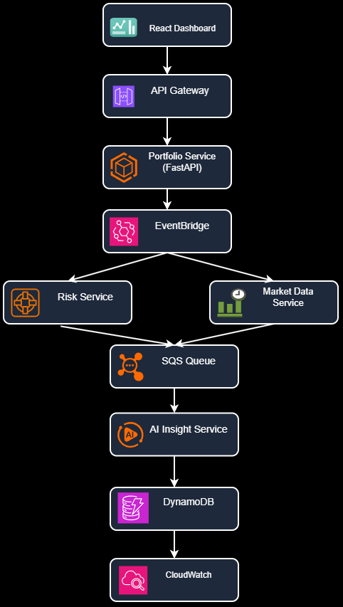

# NEXUS AI — Intelligent Portfolio Risk Command Center

## Overview

NEXUS AI is an AI-driven, event-based portfolio monitoring system designed for digital wealth management platforms. The system monitors client portfolios in near real time, detects risk conditions, generates AI-powered explanations, and visualizes alerts through an interactive dashboard.

---

## Problem Statement

The objective is to build a cloud-native portfolio intelligence platform that:

- Tracks portfolio value dynamically
- Detects allocation drift (>5%)
- Detects single stock exposure (>20%)
- Detects daily portfolio drop (>3%)
- Generates AI-based recommendations
- Displays insights through a dashboard

---

## System Architecture




The system follows an event-driven microservices architecture designed for AWS-native deployment.

Architecture follows:

Microservices + Event Driven + AWS-Native design

Components:

- React Dashboard
- Portfolio Service
- Market Data Service
- Risk Service
- AI Insight Service
- Event Simulation Layer

AWS deployment design:

- API Gateway
- EventBridge
- SQS
- DynamoDB
- CloudWatch

---

## Microservices

### Portfolio Service
Responsibilities:

- Stores client portfolios
- Computes portfolio values
- Exposes REST APIs

### Market Data Service
Responsibilities:

- Simulates stock updates
- Publishes price events

### Risk Service
Responsibilities:

- Calculates risk
- Detects:
  - allocation drift
  - stock concentration
  - daily drop

### AI Insight Service
Responsibilities:

- Converts structured risk signals into explanations
- Generates actions
- Returns structured output

---

## Event Schemas

Implemented:

1. PriceUpdated
2. PortfolioRevalued
3. RiskThresholdBreached
4. AIInsightGenerated

---

## Risk Detection Logic

### Exposure Risk

Trigger:

Single holding >20%

### Allocation Drift

Trigger:

Deviation >5%

### Daily Portfolio Drop

Trigger:

Daily portfolio loss >3%

---

## AI Prompt Approach

Hybrid strategy:

- Deterministic rules detect risk
- AI generates explanations and recommendations

Prompt design goals:

- Avoid financial guarantees
- Return structured responses
- Include advisory disclaimer

Example:

"Portfolio exposure in AMGN exceeds recommended concentration thresholds. Consider diversification."

---

## Architectural Tradeoffs

Decisions:

- Used simulated market feeds rather than real APIs
- Used local execution for development speed
- Used event simulation instead of full AWS deployment

Advantages:

- Faster implementation
- Easier debugging
- Modular services

Limitations:

- Not real-time market data
- No production deployment

---

## Scaling Strategy

For large-scale deployment:

- API Gateway for routing
- EventBridge for event distribution
- SQS for decoupling
- Lambda/ECS for services
- DynamoDB for portfolio storage
- CloudWatch for monitoring

---

## Dashboard Features

- Client portfolio cards
- AI Health Score
- Live Market Ticker
- AI Threat Radar
- Dynamic Activity Feed
- AI Assistant
- Presentation Mode
- Charts
- Risk Alerts

---

## Future Enhancements

- Bedrock integration
- Real-time market APIs
- Authentication
- WebSockets
- Real AI assistant
- Full AWS deployment

---

## Run Instructions

Backend:

```bash
uvicorn main:app --reload
```

Frontend:

```bash
npm install
npm run dev
```

---

## Authors

Deena Grace

NEXUS AI Portfolio Risk Command Center